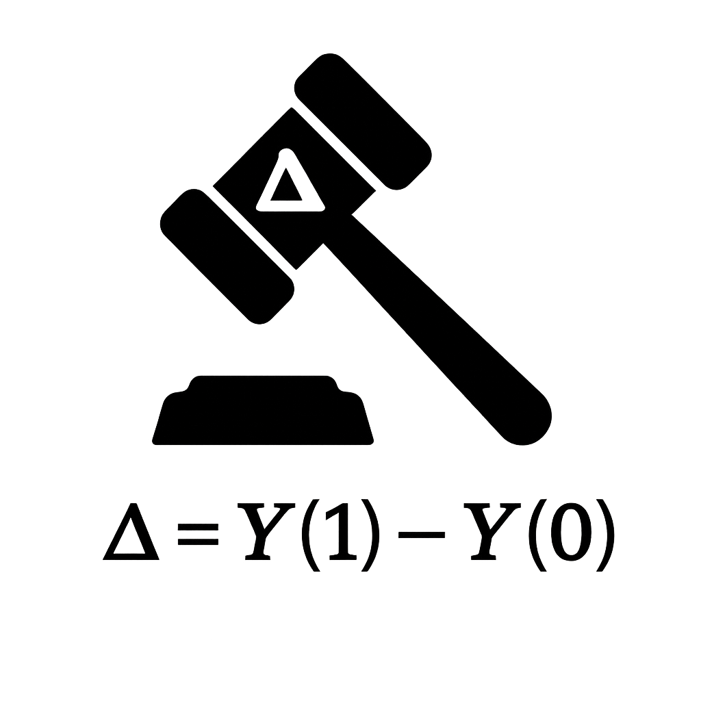

.. CJE-Core documentation master file, created by
   sphinx-quickstart on Wed Jun 11 16:07:45 2025.
   You can adapt this file completely to your liking, but it should at least
   contain the root `toctree` directive.

CJE: Causal Judge Evaluation Toolkit
=====================================

.. image:: https://img.shields.io/pypi/v/cje.svg
   :target: https://pypi.org/project/cje/
   :alt: PyPI version

.. image:: https://img.shields.io/badge/python-3.9+-blue.svg
   :target: https://www.python.org/downloads/
   :alt: Python version

.. image:: https://img.shields.io/github/license/fondutech/causal-judge-evaluation.svg
:target: https://github.com/fondutech/causal-judge-evaluation/blob/main/LICENSE
   :alt: License

CJE provides **robust off-policy evaluation** for Large Language Models using causal inference methods. Estimate policy improvements without deployment using logged interaction data.

.. raw:: html

   

   <a href="start_here.html" style="display: inline-block; background: #0969da; color: white; padding: 16px 32px; border-radius: 8px; text-decoration: none; font-size: 1.2em; font-weight: bold; box-shadow: 0 2px 4px rgba(0,0,0,0.1); transition: all 0.2s;">
   🚀 Start Here - Choose Your Path
   </a>
   

.. important::
   **First time here?** Click the button above to find your personalized learning path (5 min → 45 min tracks)

**What is CJE?** A toolkit that answers "What would happen if we deployed policy π'?" using only historical logs:

* **📊 Causal, not correlational**: Corrects for distribution shift between logged and target policies
* **⚡ Faster evaluation**: Reuses existing responses with teacher-forced scoring
* **🎯 Tighter confidence intervals**: Via calibrated doubly-robust estimation
* **🔬 Theory-backed**: Implements Algorithm 1 from the CJE paper with single-rate efficiency

⚡ Quick Start Examples
----------------------

**5-Minute Test Run**

.. code-block:: bash

   # Clone and install
   git clone https://github.com/fondutech/causal-judge-evaluation.git
   cd causal-judge-evaluation
   poetry install
   
   # Run test
   cje run --cfg-path configs --cfg-name arena_test

**Compare Two System Prompts**

.. code-block:: python

   from cje.pipeline import run_pipeline
   
   # Run with configuration files (Hydra-based)
   results = run_pipeline(
       cfg_path="configs",
       cfg_name="my_experiment"
   )
   
   # Results contain the complete experiment output
   print(f"Results: {results}")
   
   # For programmatic usage, use estimators directly:
   from cje.estimators import get_estimator
   estimator = get_estimator("DRCPO", sampler=sampler)
   estimator.fit(data)
   estimate_result = estimator.estimate()
   print(f"Policy estimates: {estimate_result.v_hat}")

**Arena-Style Evaluation**

.. code-block:: python

   from examples.arena_interactive import ArenaAnalyzer
   
   analyzer = ArenaAnalyzer()
   analyzer.quick_test()  # Run with sample data
   analyzer.plot_estimates()  # Visualize results

🏗️ Architecture Overview
------------------------

CJE implements a principled pipeline for causal evaluation:

.. code-block:: text

   Dataset → Log Probabilities → Judge Scores → Causal Estimation → Results
      ↓            ↓                  ↓              ↓                ↓
   CSV/JSON   π₀(a|x), π'(a|x)    Human/AI Judge   DR-CPO/MRDR    Policy Rankings

**Key Innovation**: Doubly-robust estimation corrects for distribution shift between your logged policy π₀ and target policy π' you want to evaluate.

📚 Documentation Structure
--------------------------

.. toctree::
   :maxdepth: 1
   :caption: Getting Started

   start_here
   installation
   quickstart

.. toctree::
   :maxdepth: 2
   :caption: User Guides

   guides/index

.. toctree::
   :maxdepth: 2
   :caption: Tutorials & Examples

   tutorials/index

.. toctree::
   :maxdepth: 2
   :caption: Technical Reference

   theory/index
   api/estimators
   api/index

.. toctree::
   :maxdepth: 1
   :caption: Advanced Topics

   contributing
   changelog
   license

🔍 Estimator Quick Reference
----------------------------

Choose the right method for your use case:

.. list-table:: Estimator Selection Guide
   :header-rows: 1
   :widths: 12 20 15 25 28

   * - Method
     - Theoretical Properties
     - Computational Cost
     - Key Advantages
     - From Paper?
   * - **IPS**
     - Unbiased, high variance
     - Very Low
     - Simple, fast, interpretable
     - ✅ Classical baseline
   * - **SNIPS**
     - ≈Unbiased, lower variance
     - Low
     - Better than IPS, still simple
     - ✅ Standard method
   * - **DR-CPO**
     - **Single-rate efficient**, double robust
     - Medium
     - **Paper Algorithm 1**: Best balance of accuracy/speed
     - ✅ **Core contribution**
   * - **MRDR**
     - **Semiparametric optimal**, variance-minimizing
     - High
     - Maximum robustness and precision
     - ⚠️ Paper mention + full implementation

.. tip::
   **💡 Recommendation**: Start with **DR-CPO** (the paper's main algorithm) for most applications, fall back to SNIPS for large-scale scenarios.

**Key Theoretical Results** *(from the paper)*:
   * **Single-Rate Efficiency**: DR-CPO achieves √n-efficiency when only ONE nuisance (weights OR outcome model) is well-specified
   * **Double Robustness**: Unbiased if either importance weights or outcome model is correct  
   * **Semiparametric Optimality**: MRDR attains the Cramér-Rao lower bound when both nuisances converge

🎯 Common Use Cases
-------------------

**System Prompt Engineering**
   Test different communication styles and response formats
   → :doc:`guides/user_guide` → "System Prompt Engineering"

**Model Upgrades**
   Evaluate if upgrading to a newer/larger model improves performance
   → :doc:`guides/user_guide` → "Model Comparison"

**Parameter Tuning**
   Optimize temperature, top-p, and other generation parameters
   → :doc:`guides/user_guide` → "Parameter Tuning"

**ChatBot Arena Analysis**
   Large-scale evaluation using human preference data
   → :doc:`guides/arena_analysis` → Complete end-to-end guide

**A/B Test Analysis**
   Convert pairwise comparison data into policy utilities
   → :doc:`tutorials/pairwise_evaluation` → Bradley-Terry modeling

📊 Performance Benchmarks
-------------------------

Expected performance characteristics (empirical validation in progress):

- **Significant MSE reduction** vs naive importance sampling
- **Further improvements** with outcome modeling (MRDR)
- **Robust teacher forcing** implementation across providers
- **Scales to millions** of logged interactions with cross-fold processing

🚨 Quick Troubleshooting
------------------------

**Wide confidence intervals?**
   → More data, similar policies, or try SNIPS estimator

**Estimators disagree significantly?**
   → Check calibration plots, consider more ground truth labels

**Slow performance?**
   → Use IPS/SNIPS, reduce mc_samples, or smaller models

**Configuration errors?**
   → Run ``cje validate`` before experiments

.. seealso::
   Each guide includes comprehensive troubleshooting sections for specific workflows.

🏆 Research & Citation
---------------------

This implementation is based on the **Causal Judge Evaluation** research paper:

.. code-block:: bibtex

   @article{landesberg2025cje,
     title={Causal Judge Evaluation (CJE): Unbiased, Calibrated \& Cost-Efficient Off-Policy Metrics for LLM Systems},
     author={Landesberg, Eddie},
     year={2025},
     note={Implementation available at https://github.com/fondutech/causal-judge-evaluation}
   }

**Paper Highlights**:
   * **Algorithm 1**: Cross-fitted Calibrated DR-CPO (exact implementation in ``MultiDRCPOEstimator``)
   * **Theorem 5.2**: Single-rate efficiency through isotonic weight calibration
   * **Section 6**: Production deployment guidelines and compute cost analysis

**Implementation Enhancements** *(beyond paper baseline)*:
   * Multi-policy joint evaluation with full covariance estimation
   * Optional outcome model calibration for additional robustness  
   * Production-grade numerical stabilization and diagnostics
   * Automatic model selection and weight monitoring

If you use CJE in your research, please cite the paper above. For implementation-specific features, you may also reference this software package.

Indices and Tables
==================

* :ref:`genindex`
* :ref:`modindex`
* :ref:`search`

